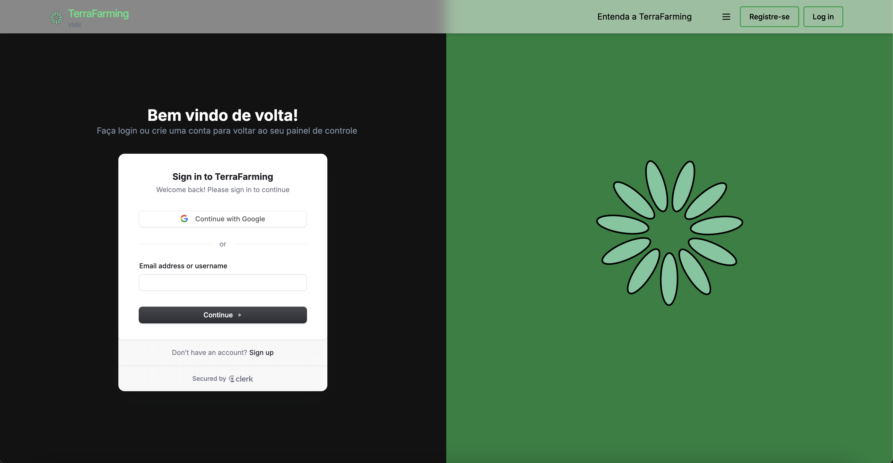
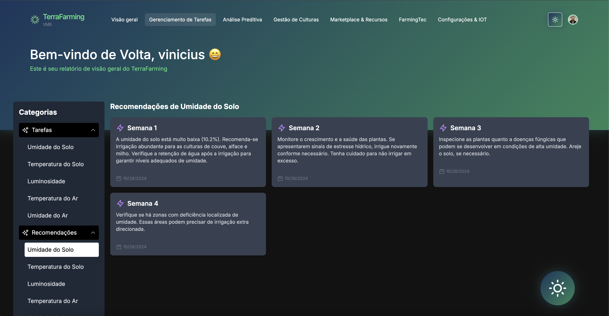
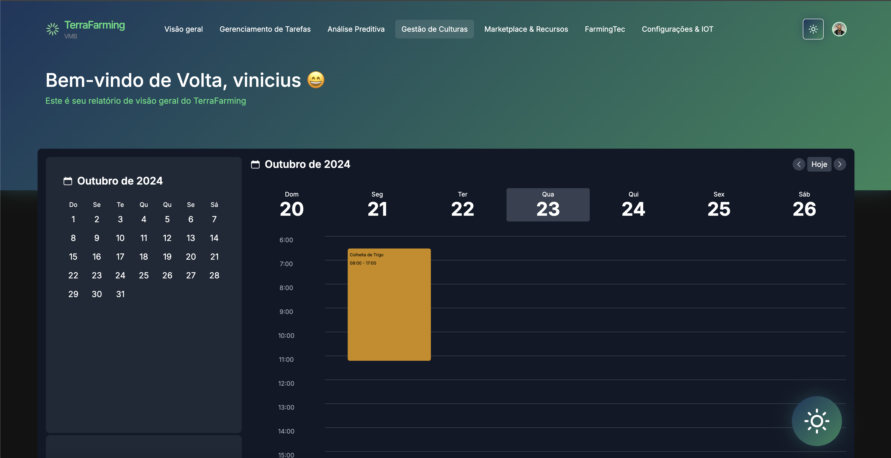
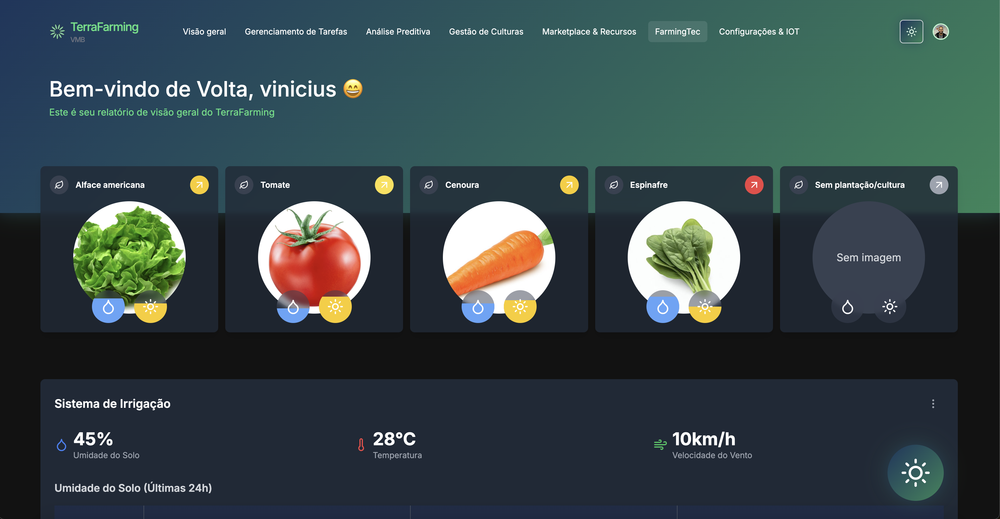
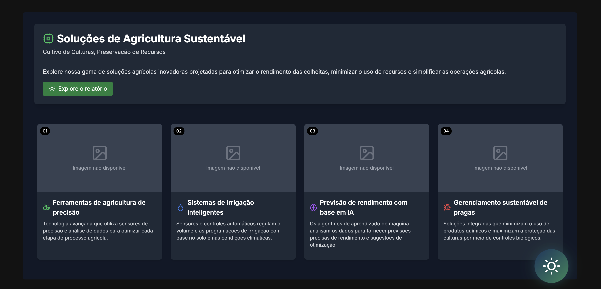
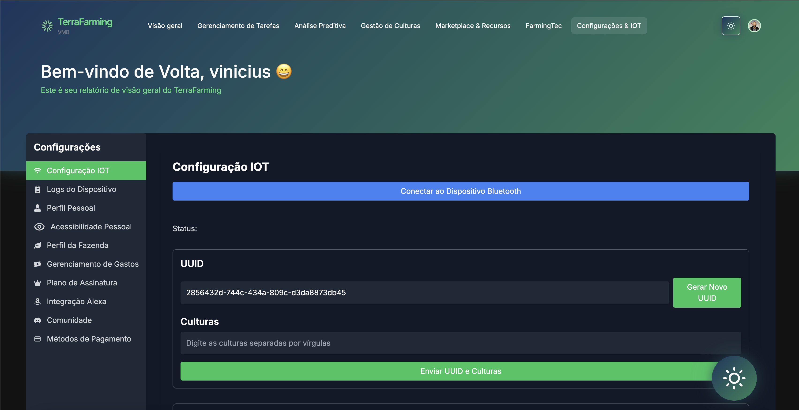
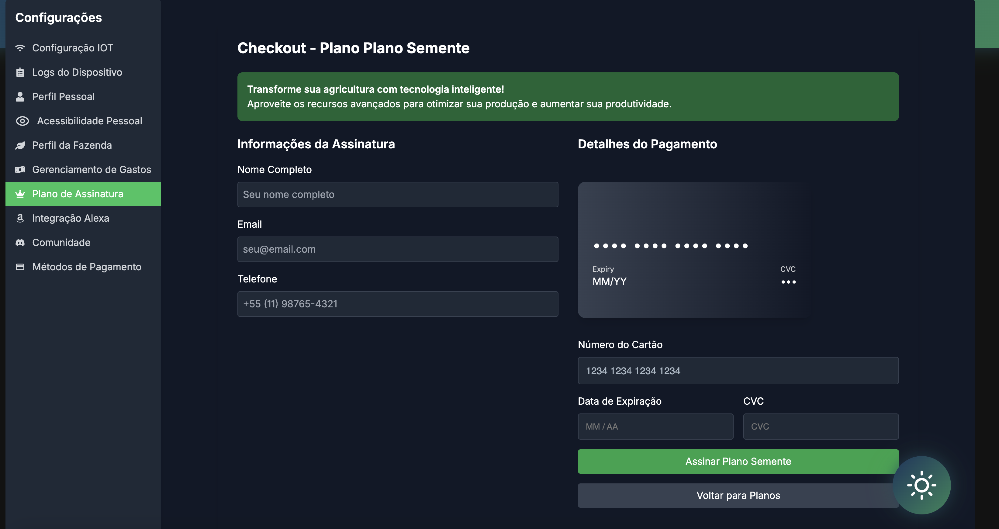
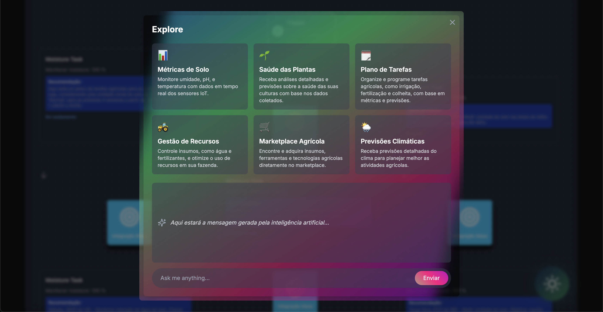

# 🌱 TerraFarming

Bem-vindo ao TerraFarming, a plataforma web que transforma a agricultura tradicional em uma agricultura inteligente e sustentável. Utilizando tecnologias de ponta como NextJS, React, Tailwind CSS e AWS Bedrock, oferecemos soluções inovadoras para otimizar e automatizar o gerenciamento de culturas através de dispositivos IoT.


## 📚 Índice

- [Visão Geral](#visão-geral)
- [Gerenciamento de Tarefas](#gerenciamento-de-tarefas)
- [Análise Preditiva](#análise-preditiva)
- [Gestão de Culturas](#gestão-de-culturas)
- [Marketplace & Recursos](#marketplace-recursos)
- [FarmingTec](#farmingtec)
- [Configurações & IoT](#configurações-iot)
- [IÁgrix: Seu Assistente Inteligente](#iágrix-seu-assistente-inteligente)
- [Tecnologias Utilizadas](#tecnologias-utilizadas)
- [Instalação](#instalação)
- [Contribuição](#contribuição)
- [Licença](#licença)

## 🌍 Porque o TerraFarming?

Conheça as nossas soluções acessando o nosso site através do "Entenda a TerraFarming".


---


## 🌟 Visão Geral

Facilidade no acesso:
- Acesse o TerraFarming por meio da sua conta do Google ou login por meio do seu email cadastrado na plataforma.



A plataforma TerraFarming oferece uma visão completa do estado atual das suas plantações, integrando dados colhidos por sensores IoT que monitoram:

- Umidade do Solo
- Temperatura do Solo
- Luminosidade
- Temperatura do Ar
- Umidade do Ar


## 🗂️ Gerenciamento de Tarefas

Planeje e acompanhe suas atividades agrícolas com base em recomendações inteligentes geradas por nossa IA. As tarefas são priorizadas conforme as necessidades específicas da sua cultura.


---

Utilize as recomendações para mais eficiência na sua agricultura.



## 🔍 Análise Preditiva

Utilize modelos preditivos para antecipar necessidades e riscos, maximizando a produtividade e minimizando desperdícios. Nossa IA analisa dados históricos e atuais para fornecer insights valiosos.


---

Obtenha relatórios avançados de análise preditiva sobre a saúde da sua agricultura.


## 🌾 Gestão de Culturas

Monitore a saúde e o desenvolvimento das suas plantações em tempo real. Receba alertas e recomendações personalizadas para garantir o crescimento ideal das culturas.



---

Obtenha um relatório sobre a cultura da sua agricultura.


## 🛒 Marketplace & Recursos

Acesse uma variedade de insumos, ferramentas e tecnologias agrícolas diretamente no nosso marketplace, facilitando a adoção de práticas agrícolas modernas.


## 🚜 FarmingTec

Explore tecnologias de ponta e inovações que ajudam a elevar suas práticas agrícolas a um novo patamar de eficiência e sustentabilidade.



---

Só o TerraFarming pode te oferecer um sistema de análise preditiva para irrigação automatizada da sua agricultura.


---

Acesse recursos educativos de acordo com as métricas da sua agricultura.



## ⚙️ Configurações & IoT

Personalize as configurações de dispositivos IoT e integre novos sensores ao seu sistema para melhorar o monitoramento e controle do ambiente agrícola.



---

Coloque os cartões de pagamento que você preferir.


---

Interaja com outros agricultores em nossa comunidade para troca de conhecimentos e melhorias entre agriculturas.


---

Saiba e execute suas atividades e recomendações de uma maneira muito fácil e acessível, integrando sua conta do TerraFarming com a Alexa.


---

Um checkout personalizado para pagamentos rápidos e efetivos.




## 🤖 IÁgrix: Seu Assistente Inteligente

IÁgrix é o assistente de inteligência artificial do TerraFarming, projetado para gerenciar todos os dados agrícolas de forma eficiente. Ele oferece suporte generalizado, ajudando a otimizar processos e a tomar decisões informadas. Com análises em tempo real, IÁgrix fornece recomendações personalizadas para:

- Irrigação e manejo de água
- Fertilização e uso de nutrientes
- Prevenção e controle de pragas
- Planejamento de colheitas

A inteligência de IÁgrix garante que você obtenha o máximo de suas operações agrícolas, aumentando a produtividade e promovendo a sustentabilidade.



## 🛠️ Tecnologias Utilizadas

- **NextJS** e **React**: Para a construção da interface web moderna e responsiva.
- **Tailwind CSS**: Para estilização rápida e eficiente.
- **AWS Bedrock**: Para implementação de inteligência artificial e aprendizado de máquina.
- **IoT Devices**: Para coleta de dados ambientais em tempo real.

## 🚀 Instalação

1. Clone o repositório:

   ```bash
   git clone https://github.com/seu-usuario/terrafarming.git

2. Instale as dependências:

   ```bash
   Copiar
   cd terrafarming
   npm install

3. Inicie o servidor de desenvolvimento:

   ```bash
   npm run dev
   Acesse a plataforma em http://localhost:3000.

🤝 Contribuição
---------------

Contribuições são bem-vindas! Siga as etapas no arquivo `CONTRIBUTING.md` para começar.

📄 Licença
----------

Este projeto está licenciado sob a Licença MIT. Veja o arquivo `LICENSE` para mais detalhes.

* * * * *

### 🏆 Arquitetado e desenvolvido por Vinicius Prudencio - VMB - Challenge FIAP 2024